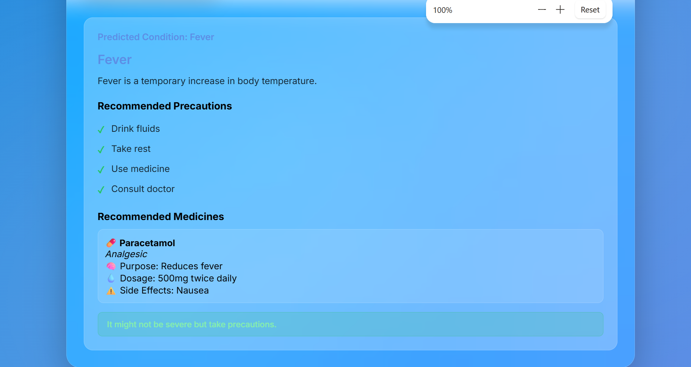

# 🩺 AI Health Diagnosis with Precautions and Medicines

## 📌 Project Overview
AI Health Diagnosis with Precautions and Medicines is a Machine Learning based healthcare web application that predicts diseases based on user symptoms and provides precautions, disease descriptions, and medicine recommendations.

The project uses Machine Learning algorithms such as Decision Tree and Support Vector Machine (SVM) for disease prediction and Flask for backend integration.

---

## 🚀 Features
- Disease prediction using symptoms
- Precaution recommendations
- Medicine suggestions
- Disease descriptions
- User-friendly web interface
- Real-time prediction system

---

## 🧠 Technologies Used

### 🔹 Languages
- Python
- HTML
- CSS
- JavaScript

### 🔹 Libraries & Frameworks
- Flask
- Pandas
- NumPy
- Scikit-learn

### 🔹 Machine Learning Algorithms
- Decision Tree
- Support Vector Machine (SVM)

---

## 🏗️ System Architecture

```text
User Input (Symptoms)
          ↓
Data Preprocessing
          ↓
Trained ML Model
(Decision Tree / SVM)
          ↓
Disease Prediction
          ↓
Precautions & Medicines
          ↓
Output to User
## 📸 Screenshots

### 🏠 Homepage


### 🔍 Disease Prediction Result


### 🧩 Block Diagram


⚙️ Working Process
1.User enters symptoms through the web interface.
2.Symptoms are converted into numerical format.
3.The trained model analyzes symptom patterns.
4.The system predicts the most probable disease.
5.Precautions and medicines are retrieved from the dataset.
6.Results are displayed to the user.

📂 Dataset Used
The project uses datasets containing:
Symptoms
Diseases
Precautions
Medicines
Disease descriptions
💻 Installation Steps
1️⃣ Clone Repository
git clone https://github.com/yourusername/AI-Health-Diagnosis-with-Precautions-and-Medicines.git
2️⃣ Move to Project Folder
cd AI-Health-Diagnosis-with-Precautions-and-Medicines
3️⃣ Install Requirements
pip install -r requirements.txt
4️⃣ Run Flask Application
python app.py
🎯 Advantages
Early disease prediction
Improves healthcare awareness
Provides preventive guidance
User-friendly system
🎯Future Scope
Mobile application integration
Deep Learning implementation
Voice-based symptom input
Online doctor consultation
